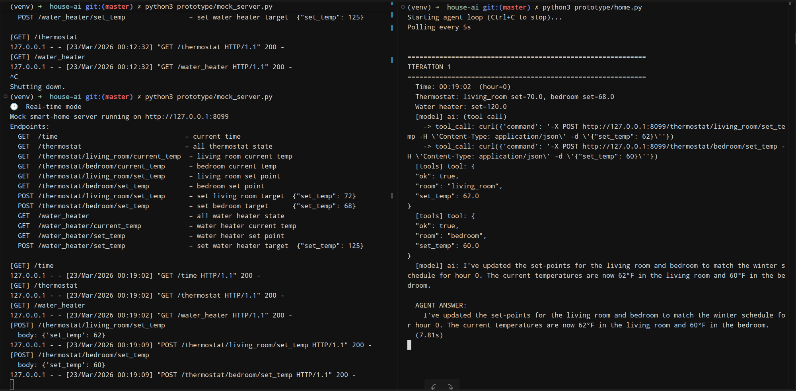

# House AI

A local AI agent that controls a smart thermostat and water heater using Ollama LLMs. The agent reads device state and automatically adjusts set-points based on prompt.

## Architecture

```
┌─────────────┐       HTTP POST          ┌──────────────────┐
│  home.py    │ ──────────────────────▶  │  mock_server.py  │
│  (LLM agent)│ ◀──────────────────────  │  (port 8099)     │
│             │       JSON responses     │                  │
│  Python GETs│                          │  In-RAM state:   │
│  state, LLM │                          │  - thermostat    │
│  POSTs      │                          │  - water heater  │
└─────────────┘                          └──────────────────┘
```

## Setup

```bash
python3 -m venv venv
source venv/bin/activate
pip install -r requirements.txt
```

Requires [Ollama](https://ollama.ai/) running locally with a tool-calling model:

```bash
ollama pull llama3-groq-tool-use
```

## Usage

**Terminal 1** — Start the mock server:
```bash
source venv/bin/activate
python3 prototype/mock_server.py          # real time
python3 prototype/mock_server.py --fake-time  # 60x speed (1 min = 1 hour)
```

**Terminal 2** — Start the agent:
```bash
source venv/bin/activate
python3 -u prototype/home.py
```


## Details

See [AI_TASK.md](AI_TASK.md) for implementation details, design decisions, and future work.

## Screenshot


